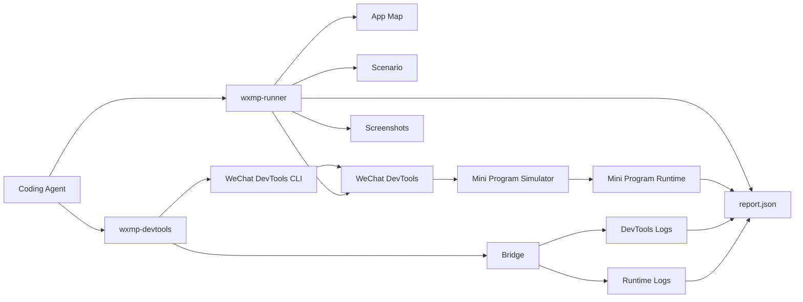

# miniprogram-agent-bridge

一个给 Agent 用的微信小程序联调工具。

它解决的是这类问题：

- 打开开发者工具、构建项目、启动日志桥
- 在模拟器里真实点击、输入、上传图片
- 等待页面跳转或 AI 回复
- 读取当前页面 data、console、exception
- 保存截图和一整次执行的报告

## 架构图



## 有什么用

仓库里有三层能力：

- `wxmp-devtools`
  - 封装微信开发者工具 CLI
  - 支持 `open`、`build-npm`、`preview`、`upload`、`dev`、`status`
- `bridge`
  - 收集 DevTools 和小程序运行时日志
- `wxmp-runner`
  - 驱动真实模拟器执行一段 flow
  - 支持点击、输入、上传、截图、读页面状态、等待 AI 回复

## 怎么用

### 1. 安装

要求：

- Node.js 20+
- macOS
- 已安装微信开发者工具

安装依赖：

```bash
npm install
```

默认微信开发者工具 CLI 路径：

```bash
/Applications/wechatwebdevtools.app/Contents/MacOS/cli
```

### 2. 准备 adapter

adapter 用来告诉 runner 你的项目路由、selector、以及如何提取页面里的 AI 回复。

在 flow 里，`routeKey` 会查 `routes`，`selectorKey` 会查 `selectors`。

示例：

[`examples/basic.adapter.cjs`](examples/basic.adapter.cjs)

最小结构：

```js
module.exports = {
  name: "your-miniapp",
  routes: {
    home: "/pages/index/index",
    conversation: "/pages/chat/index"
  },
  selectors: {
    uploadEntry: ".upload-button",
    primaryInput: ".chat-input",
    primarySubmit: ".chat-send",
    onboardingSkip: ".skip"
  },
  extractAssistantReply(pageData) {
    const messages = Array.isArray(pageData && pageData.messages) ? pageData.messages : [];
    return messages.filter((item) => item.role === "ai").slice(-1)[0]?.text || "";
  }
};
```

### 3. 准备 flow

flow 是一段真实 UI 步骤。

示例：

[`examples/basic.flow.cjs`](examples/basic.flow.cjs)

支持的 step 类型：

- `ensure-home`
- `relaunch`
- `wait`
- `wait-page`
- `tap`
- `input`
- `mock-choose-media`
- `seed-storage`
- `wait-detail`
- `wait-chat-answer`
- `read-current-page`
- `observe`
- `screenshot`

示例：

```js
module.exports = {
  name: "basic-smoke",
  steps: [
    { type: "ensure-home" },
    { type: "observe", name: "home" },
    { type: "mock-choose-media" },
    { type: "tap", selectorKey: "uploadEntry", waitMs: 500 },
    { type: "relaunch", routeKey: "conversation" },
    { type: "input", selectorKey: "primaryInput", value: "你好" },
    { type: "tap", selectorKey: "primarySubmit" },
    { type: "wait-chat-answer" },
    { type: "observe", name: "conversation" }
  ]
};
```

### 4. 检查环境

```bash
npx wxmp-devtools doctor --project /absolute/path/to/miniprogram-project
npx wxmp-runner doctor \
  --project /absolute/path/to/miniprogram-project \
  --adapter /absolute/path/to/adapter.cjs
```

### 5. 打开开发者工具并启动日志桥

```bash
npx wxmp-devtools dev --project /absolute/path/to/miniprogram-project
```

### 6. 执行一段真实 flow

```bash
npx wxmp-runner run-flow \
  --project /absolute/path/to/miniprogram-project \
  --adapter /absolute/path/to/adapter.cjs \
  --flow /absolute/path/to/flow.cjs \
  --fixture /absolute/path/to/test-image.jpg
```

### 7. 输出结果

默认输出目录在目标项目下：

- bridge 日志：`<project>/.wechat-agent/bridge`
- runner 报告：`<project>/.wechat-agent/runs`

每次执行都会生成 `report.json`，里面包括：

- 最终页面路径
- 最终页面 data
- 过程 trace
- console 事件
- exception 事件
- 截图路径

## 常用命令

```bash
npx wxmp-devtools open --project /absolute/path/to/miniprogram-project
npx wxmp-devtools build-npm --project /absolute/path/to/miniprogram-project
npx wxmp-devtools status --project /absolute/path/to/miniprogram-project
```

```bash
npx wxmp-runner doctor --project /absolute/path/to/miniprogram-project --adapter /absolute/path/to/adapter.cjs
npx wxmp-runner run-flow --project /absolute/path/to/miniprogram-project --adapter /absolute/path/to/adapter.cjs --flow /absolute/path/to/flow.cjs
```

## 说明

- `run-flow` 是通用入口
- 旧的场景命令还保留，用于兼容已有脚本
- 如果你的项目页面结构不同，改 adapter 和 flow 就够了，不需要改 runner 核心
